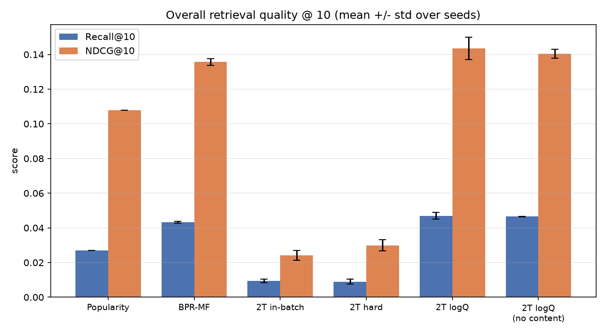
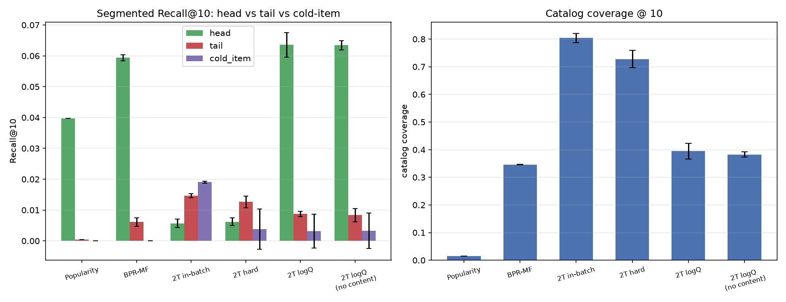
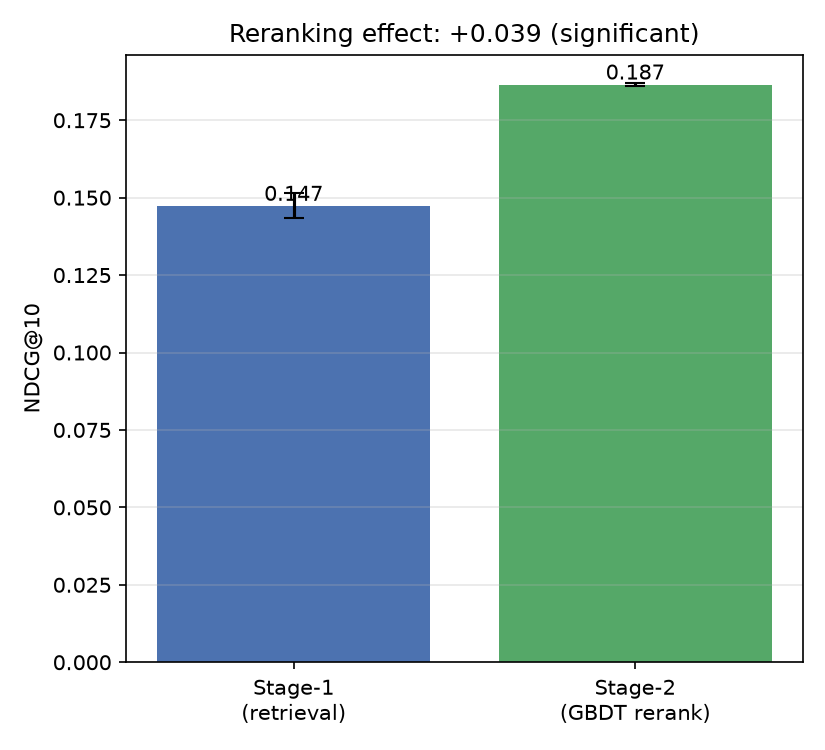
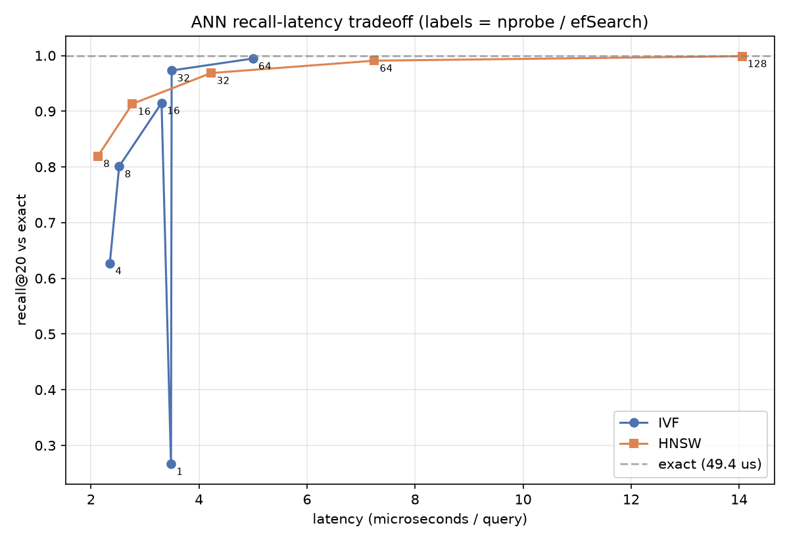

# MovieLens Two-Stage Recommender


A retrieval-then-ranking recommender on MovieLens, built in the shape a real
industrial system takes: a cheap first stage that narrows a large catalog to a few
hundred candidates, and a more expensive second stage that carefully reorders them.
The goal is not to chase a single accuracy number, but to demonstrate sound
judgment about how a ranking system behaves under realistic constraints, and to
report honestly what works and what does not.

Rather than training one model and reporting one favorable metric, the project is
organized around a set of questions: does the two-stage structure earn its
complexity, what actually determines whether the two-tower works, where does each
model help once you look past the aggregate score, and can the evaluation itself be
trusted. Strong baselines come first (popularity, then BPR matrix factorization),
followed by a two-tower retriever with a content tower, and a gradient-boosted
reranker.

**Stack.** PyTorch (two-tower retrieval), FAISS with IVF and HNSW (approximate
nearest-neighbor search), LightGBM (LambdaRank reranker), and sentence-transformers
(pretrained title embeddings for the content tower), trained on implicit-feedback
MovieLens data.

**Evaluation protocol.** A global temporal split (train on the past, test on the
future) to avoid leakage; every metric averaged over three seeds and reported as
mean plus or minus standard deviation; and a guardrail that reports any difference
smaller than the seed noise as "within noise" rather than as a result. Metrics are
also broken down by head, tail, cold-item, cold-user, and catalog-coverage segments
so that aggregate numbers do not hide where a model actually helps.

## Getting Started

```bash
git clone https://github.com/K-YLMike/recommender-system-movielens.git
cd recommender-system-movielens

python -m venv .venv && source .venv/bin/activate
pip install -r requirements.txt

bash data/download.sh ml-1m          # download MovieLens once, into ./raw

python scripts/run_data_prep.py
python scripts/run_baseline_pop.py
python scripts/run_content_features.py
python scripts/run_retrieval_mf.py
python scripts/run_retrieval_twotower.py
python scripts/run_evaluate.py
python scripts/run_ranking_gbdt.py

python plots.py --results-dir ml-1m/results
```

Results are written to `ml-1m/results/`. On CPU the MovieLens-1M run completes in a
few minutes; only the two-tower meaningfully benefits from a GPU (with one, swap
`faiss-cpu` for `faiss-gpu-cu12` and install a CUDA build of torch). Switch to the
larger dataset by setting `dataset: ml-25m` in `configs/config.yaml`.

## Results

MovieLens-1M, averaged over three seeds. The noise rule is enforced in code
(`src/utils/stats.py`).

**Negative sampling is the decisive factor, not the architecture.** The same
two-tower reaches Recall@10 of 0.047 with a logQ popularity correction, but only
0.009 with plain in-batch negatives, a 5x difference from a single design choice.

**The two-tower only edges a strong baseline.** The logQ two-tower reaches 0.047
against 0.043 for BPR matrix factorization. On clean MovieLens a well-tuned classic
baseline is hard to beat, and that is stated plainly.

**The advantage is in coverage and the tail, not the head.** Against the popularity
baseline, the logQ two-tower achieves roughly 26x the catalog coverage (0.39 vs
0.015) and about 20x the tail recall, while head performance is comparable. This is
precisely why an aggregate Recall number alone would be misleading.

**Hard negatives degraded performance** here, likely because batch-level mining
introduces bias on a dataset this small. It is retained as an honest negative result.

**Reranking is effective.** The GBDT reranker lifts NDCG@10 from 0.147 to 0.187, a
27 percent relative gain that clears the seed noise.

**Approximate search is nearly free.** HNSW retains about 97 percent of exact recall
at roughly one tenth of the latency.

**Cold-start requires larger data to surface.** On MovieLens-1M the content tower
shows no measurable cold-start gain, because the dataset contains only 544 cold
items, most without test interactions. This is a property of the data, and the
specific hypothesis to re-test on MovieLens-25M.

### Retrieval quality @ 10

| Retriever | Recall@10 | NDCG@10 | Coverage@10 |
|---|---|---|---|
| Popularity | 0.0271 | 0.108 | 0.015 |
| BPR-MF | 0.0433 | 0.136 | 0.346 |
| Two-tower (in-batch) | 0.0094 | 0.024 | 0.804 |
| Two-tower (hard) | 0.0090 | 0.030 | 0.728 |
| **Two-tower (logQ)** | **0.0470** | **0.143** | 0.394 |
| Two-tower (logQ, no content) | 0.0465 | 0.140 | 0.382 |









Dataset profile: 6,011 users, 3,678 items, 900k training interactions, sparsity
0.96, popularity Gini 0.64 (`docs/results/dataset_stats.json`).

## How it works

Stage one retrieves a few hundred candidates from roughly 3.7k items using three
retrievers (popularity, BPR matrix factorization, and the headline two-tower).
Stage two reranks those candidates with a LightGBM LambdaRank model.

The two-tower combines a user tower (a user embedding plus a mean pool of recent
item history) and an item tower (an item embedding, a genre projection, and a
projection of a pretrained sentence embedding of the title). The content path lets a
new item with no interaction history still be represented, which is the mechanism
behind cold-start handling.

The pipeline is crash-safe and resumable: each stage writes its outputs atomically
and marks completion with a `_DONE.json` file, and training checkpoints the model,
optimizer, and RNG state so a run resumes exactly where it stopped.

## Future Work

This is the offline skeleton of a recommender, with a clear path to grow. The
immediate next step is MovieLens-25M, where the content tower's cold-start value
should surface. Further extensions include streaming and near-real-time features,
approximate search over substantially larger catalogs, multi-objective ranking that
balances relevance with diversity and freshness, correction for position and
selection bias, and a move from a static offline split to online A/B testing with
continuous retraining.

## License

Released under the MIT License: free to use, modify, and distribute, with no
warranty. Full text in [LICENSE](LICENSE).
